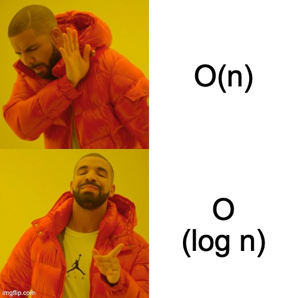

# clouda-exercise

## First part

```
- Write a function that having a start_date and an end_date as input returns the subset of data included between the two for the slug ‘aggregation-overall’ and for the key ‘score’
  - Assume the start_date and end_date exactly match the “x” key in the serie
  - start_date and end_date must be included in the returned data 
(you mean in the Expected result?).
  - The series always contains start_date and end_date
	
  Input: 
  start_date: "2015-08-19T14:00:19.352000Z"
  end_date: "2015-10-12T07:27:47.493000Z"

  Expected result:
  [
    {
      "y":282,
      "x":"2015-08-19T14:00:19.352000Z"
    },
    {
      "y":227,
      "x":"2015-10-08T14:45:31.991000Z"
    },
    {
      "y":185,
      "x":"2015-10-12T07:27:47.493000Z"
    }
  ]
```

### 1st Solution
For this first part of the exercise I wrote a function called `scoreIntervalQuery`. 

```javascript
/**
 * scoreIntervalQuery - Time Complexity: O(n)
 * @param {String} start_date
 * @param {String} end_date
 * returns {Array}
 *
 * Error: Errors.START_DATE_NOT_DEFINED
 * Error: Errors.START_DATE_TYPE_IS_NOT_A_STRING
 * Error: Errors.END_DATE_NOT_DEFINED
 * Error: Errors.END_DATE_TYPE_IS_NOT_A_STRING
 * Error: Errors.CAST_START_DATE_END_DATE_ERROR
 * Error: Errors.NO_DATA_FOR_SLUG_AGGREGATION_OVERALL
 * Error: Errors.NO_DETAILS_FOR_SLUG_AGGREGATION_OVERALL
 * Error: Errors.NO_SERIES_FOR_KEY_SCORE_IN_SLUG_AGGREGATION_OVERALL
 */
const scoreIntervalQuery = (start_date, end_date) => {
  const now = performance.now();

  // inputs check
  if (typeof start_date === "undefined") throw Errors.START_DATE_NOT_DEFINED.message;
  if (typeof start_date !== "string") throw Errors.START_DATE_TYPE_IS_NOT_A_STRING.message;
  if (typeof end_date === "undefined") throw Errors.END_DATE_NOT_DEFINED.message;
  if (typeof end_date !== "string") throw Errors.END_DATE_TYPE_IS_NOT_A_STRING.message;

  // cast date from string to date format
  const startDateCast = new Date(start_date);
  const endDateCast = new Date(end_date);

  // check cast date
  if (
    startDateCast === Constants.OTHERS.INVALID_DATE ||
    endDateCast === Constants.OTHERS.INVALID_DATE
  ) throw Errors.CAST_START_DATE_END_DATE_ERROR.message;

  // extract score object & check
  let overallData =
    data.data !== undefined && data.data.length > 0 ?
      data.data.filter(elem => elem.slug === Constants.SLUGS.AGGREGATION_OVERALL) : [];
  if (overallData.length === 0) throw Errors.NO_DATA_FOR_SLUG_AGGREGATION_OVERALL.message;

  // extract details object & check
  let scoreData = overallData.map(elem => elem.details);
  if (scoreData.length === 0) throw Errors.NO_DETAILS_FOR_SLUG_AGGREGATION_OVERALL.message;

  // extract series for key score & check
  let scoreDataSeries = scoreData[0].filter(elem => elem.key === Constants.KEYS.SCORE);
  if (
    scoreDataSeries.length === 0 ||
    typeof scoreDataSeries[0].series === "undefined"
  ) throw Errors.NO_SERIES_FOR_KEY_SCORE_IN_SLUG_AGGREGATION_OVERALL.message;

  // start search, with exit condition if currentDate is > then end date
  const result = [];
  scoreDataSeries[0].series.some(elem => {
    if (typeof elem.x === "undefined") return false
    let currentDateToCompare = new Date(elem.x);
    if (currentDateToCompare === Constants.OTHERS.INVALID_DATE) return false

    if (currentDateToCompare >= startDateCast && currentDateToCompare <= endDateCast) {
      result.push(elem);
      return false;
    }

    if (currentDateToCompare > endDateCast) return true;
  });

  const timeToComplete = (performance.now() - now) / 1000
  console.log(`Results found with "some": ${result.length} in ${timeToComplete} seconds`);
  return result;
}
```

I assumed that the inputs are strings, so the function checks if input types are string otherwise it fires an error.
I added some checks while exploring the data object in case some properties or data are missing (never say never).

I used a `.some` es6 method to loop over dates so in case my current range is ouf of current date I can stop iterate.
This is possible because the series is sort ASC by date.

### 1st Solution - Optimized

Finally, I made a 2nd function which is called `scoreIntervalQueryOptimized` that search for date range with 
binary search rather than a `some` scan of all the values. 
This is possible because the series is sort ASC by date.

```javascript
/**
 * scoreIntervalQuery - Time Complexity: O(M * log N)
 * @param {String} start_date
 * @param {String} end_date
 * returns {Array}
 *
 * Error: Errors.START_DATE_NOT_DEFINED
 * Error: Errors.START_DATE_TYPE_IS_NOT_A_STRING
 * Error: Errors.END_DATE_NOT_DEFINED
 * Error: Errors.END_DATE_TYPE_IS_NOT_A_STRING
 * Error: Errors.CAST_START_DATE_END_DATE_ERROR
 * Error: Errors.NO_DATA_FOR_SLUG_AGGREGATION_OVERALL
 * Error: Errors.NO_DETAILS_FOR_SLUG_AGGREGATION_OVERALL
 * Error: Errors.NO_SERIES_FOR_KEY_SCORE_IN_SLUG_AGGREGATION_OVERALL
 */
const scoreIntervalQueryOptimized = (start_date, end_date) => {
  const now = performance.now();

  // inputs check
  if (typeof start_date === "undefined") throw Errors.START_DATE_NOT_DEFINED.message;
  if (typeof start_date !== "string") throw Errors.START_DATE_TYPE_IS_NOT_A_STRING.message;
  if (typeof end_date === "undefined") throw Errors.END_DATE_NOT_DEFINED.message;
  if (typeof end_date !== "string") throw Errors.END_DATE_TYPE_IS_NOT_A_STRING.message;

  // cast date from string to date format
  const startDateCast = new Date(start_date);
  const endDateCast = new Date(end_date);

  // check cast date
  if (
    startDateCast === Constants.OTHERS.INVALID_DATE ||
    endDateCast === Constants.OTHERS.INVALID_DATE
  ) throw Errors.CAST_START_DATE_END_DATE_ERROR.message;

  // extract score object & check
  let overallData =
    data.data !== undefined && data.data.length > 0 ?
      data.data.filter(elem => elem.slug === Constants.SLUGS.AGGREGATION_OVERALL) : [];
  if (overallData.length === 0) throw Errors.NO_DATA_FOR_SLUG_AGGREGATION_OVERALL.message;

  // extract details object & check
  let scoreData = overallData.map(elem => elem.details);
  if (scoreData.length === 0) throw Errors.NO_DETAILS_FOR_SLUG_AGGREGATION_OVERALL.message;

  // extract series for key score & check
  let scoreDataSeries = scoreData[0].filter(elem => elem.key === Constants.KEYS.SCORE);
  if (
    scoreDataSeries.length === 0 ||
    typeof scoreDataSeries[0].series === "undefined"
  ) throw Errors.NO_SERIES_FOR_KEY_SCORE_IN_SLUG_AGGREGATION_OVERALL.message;

  // start search, binary first, then scan O(m * log n) first
  const result = [];
  const indexToStartSearch = binarySearchRange(scoreDataSeries[0].series, startDateCast, endDateCast);

  // start search left to right;
  let rightReached = false;
  let rightIndex = indexToStartSearch;
  while (!rightReached) {
    result.push(scoreDataSeries[0].series[rightIndex]);
    rightIndex++;
    if (
      scoreDataSeries[0].series[rightIndex] === undefined ||
      new Date(scoreDataSeries[0].series[rightIndex].x) > endDateCast) rightReached = true;
  }

  let leftReached = false;
  let leftIndex = indexToStartSearch;
  while (!leftReached) {
    leftIndex--;
    if (leftIndex < 0 || new Date(scoreDataSeries[0].series[leftIndex].x) < startDateCast) leftReached = true;
    if (leftReached === false) result.push(scoreDataSeries[0].series[leftIndex]);
  }

  const timeToComplete = (performance.now() - now) / 1000
  console.log(`Results found binary: ${result.length} in ${timeToComplete} seconds`);

  return result;
}
```

## HOW TO RUN THE CODE

I've used node so, once cloned the repo, running `npm start` will execute the file inside 
`scr/index.js`;

Now there are two function invocations.
```javascript
// src/index.js

// Exercise
scoreIntervalQuery('2015-08-19T14:00:19.352000Z', '2015-10-12T07:27:47.493000Z');
scoreIntervalQueryOptimized('2015-08-19T14:00:19.352000Z', '2015-10-12T07:27:47.493000Z');
```

## RESULTS
Here some results ran on my machine. Please run one instruction at time to prevent memory caching of any kind.

```javascript
// Exercise: this is the best case for 1st cause dates to search are at the begin of the series
scoreIntervalQuery('2015-08-19T14:00:19.352000Z', '2015-10-12T07:27:47.493000Z');
// Results found with "some": 3 in 0.00037344199419021606 seconds
scoreIntervalQueryOptimized('2015-08-19T14:00:19.352000Z', '2015-10-12T07:27:47.493000Z');
// Results found binary: 3 in 0.00041268500685691834 seconds


// All elements (worst case for optimized cause optimization is === to with "some" solution)
scoreIntervalQuery('2015-08-19T14:00:19.352000Z', '2019-11-19T17:14:34.796982Z');
//Results found with "some": 1086 in 0.0026423140168190004 seconds
scoreIntervalQueryOptimized('2015-08-19T14:00:19.352000Z', '2019-11-19T17:14:34.796982Z');
// Results found binary: 1086 in 0.00235623699426651 seconds


// Worst case for linear solution last few dates
scoreIntervalQuery('2019-08-02T10:33:07.768360Z', '2019-10-31T11:24:10.593497Z');
// Results found with "some": 5 in 0.002391831010580063 seconds
scoreIntervalQueryOptimized('2019-08-02T10:33:07.768360Z', '2019-10-31T11:24:10.593497Z');
// Results found binary: 5 in 0.00040950697660446165 seconds
```

Here we have seen three different scenario:
   - 1. dates at the begin of the array so full scan with `some` is a bit better 
   - 2.  we're watching a range that includes all the records so both of alg need to look at all elements in the array
   - 3.  we're searching for last elements therefore the `binarySearch` is better

For point 3. an inverted search with `some`, might have led to same results of `binarySearch` but generally speaking
it seems that for the overall scenario, the `binarySearch` approach seems better.
## Second part

```
- Write the same function as above to match the case that:
  - The series does not always contains end_date or start_date 
  - Start_date and end_date don’t match the “x” key in the serie 
```

I've realized the function above to compare the dates in a date-range philosophy. So the previous functions, if I'm
not wrong, should work also on these two additional conditions.

## Third part

```
- Consider that we want to display the data with the key “extra” on mouse over on a point of the key “score”. Write a function to format the data for this use case. 
(Format data how? Retrieve them given an input? Concatenate them, provide them as an object? Is possible to have an input/output example?)
```
For this part, I assumed that I need to retrieve the info to display from `extra` series given an `x` which is unique for that series. 
As I mentioned previously, if `x` values are sorted by data we can apply a `binarySearch` to retrieve faster the value. 
At the moment I've only implemented the solution with binarySearch.



```javascript
/**
 * retrieveExtraInfo - Time Complexity O(log n)
 * @param keyScore
 * return {Object}
 *
 * Error: Errors.KEY_STORE_NOT_A_STRING
 * Error: Errors.NO_DATA_FOR_SLUG_AGGREGATION_OVERALL
 * Error: Errors.NO_DETAILS_FOR_SLUG_AGGREGATION_OVERALL
 * Error: Errors.NO_SERIES_FOR_KEY_EXTRA_IN_SLUG_AGGREGATION_OVERALL
 */
const retrieveExtraInfo = (keyScore) => {
  // inputs check
  if (typeof keyScore !== "string") throw Errors.KEY_STORE_NOT_A_STRING.message

  // extract score object & check
  let overallData =
    data.data !== undefined && data.data.length > 0 ?
      data.data.filter(elem => elem.slug === Constants.SLUGS.AGGREGATION_OVERALL) : [];
  if (overallData.length === 0) throw Errors.NO_DATA_FOR_SLUG_AGGREGATION_OVERALL.message;

  // extract details object & check
  let extraData = overallData.map(elem => elem.details);
  if (extraData.length === 0) throw Errors.NO_DETAILS_FOR_SLUG_AGGREGATION_OVERALL.message;

  // extract series for key score & check
  let extraDataSeries = extraData[0].filter(elem => elem.key === Constants.KEYS.EXTRA);
  if (
    extraDataSeries.length === 0 ||
    typeof extraDataSeries[0].series === "undefined"
  ) throw Errors.NO_SERIES_FOR_KEY_EXTRA_IN_SLUG_AGGREGATION_OVERALL.message;

  // perform binary search
  let result = binarySearch(extraDataSeries[0].series, new Date(keyScore));
  if (typeof result.y !== "undefined") return result.y
  return {}
}
```

